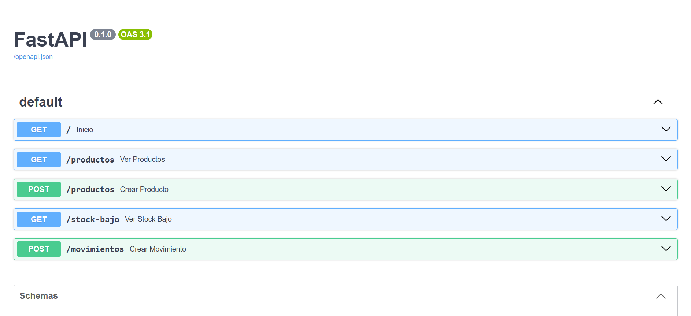

# 📦 Sistema de inventario

Un programa en Python para llevar el control de un negocio desde la consola: qué hay en bodega, qué entra, qué sale y qué está por acabarse.

> Proyecto hecho paso a paso mientras aprendo, con la idea de que sirva en un negocio real.

## 💡 Por qué lo hice
Quería crear algo útil para empresas, no solo un ejercicio de clase. Muchos negocios todavía llevan su inventario a mano o en una libreta, y eso les cuesta tiempo y dinero. Este proyecto es mi primer intento de resolver ese problema.

## ✨ Qué hace
- 🛒 Agrega productos con nombre, cantidad, precio y cantidad mínima
- 🔍 Lista y busca productos por nombre
- 📥 Registra entradas y 📤 salidas de mercancía, con historial de movimientos
- 🚫 Evita sacar más piezas de las que hay en bodega
- ⚠️ Avisa qué productos están por acabarse

## 🚀 Cómo ejecutarlo
1. Instala Python 3
2. Descarga este repositorio
3. En la terminal, dentro de la carpeta, ejecuta:

```
python main.py
```

## 🌐 API con FastAPI
1. Crea y activa un entorno virtual:

```
python -m venv venv
venv\Scripts\activate
```

2. Instala las librerías:

```
pip install fastapi uvicorn
```

3. Enciende la API:

```
uvicorn api:app --reload
```

4. Abre http://127.0.0.1:8000/docs para probarla




### Rutas
- `GET /productos`: lista los productos
- `POST /productos`: agrega un producto
- `GET /stock-bajo`: productos que están por acabarse
- `POST /movimientos`: registra una entrada o salida de mercancía

## 🛠️ Tecnologías
- Python
- SQLite
- Git y GitHub
- FastAPI

## 🗺️ Lo que sigue
- [x] API con FastAPI
- [ ] Reporte de inventario en CSV o Excel
- [ ] Interfaz web

## 👋 Autor
**Angel Franyutty**, estudiante de Ingeniería en Sistemas Computacionales en el Instituto Tecnológico de Ensenada.